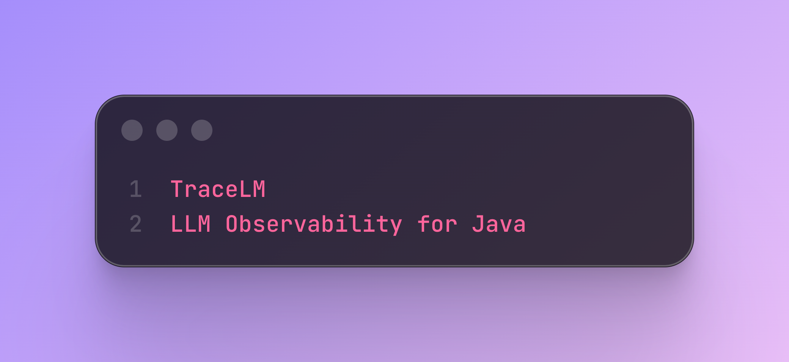

# tracelm-java-agent

# Tracelm Demo

TraceLM – LLM Observability for Java (Agent-Based, Zero Code Changes)

Gain deep visibility into your LLM calls — track latency, errors, and model usage with zero code changes.

## 🤔 Why TraceLM?

LLM applications are hard to debug and monitor.

TraceLM solves this by:
- Capturing LLM calls without modifying your code
- Providing real-time latency and usage insights
- Enabling production-grade observability for AI systems

  
🚀 Overview

TraceLens is a lightweight LLM observability system for Java applications built using a Java Agent.

It enables you to monitor and analyze LLM interactions without modifying your application code.

TraceLens captures:

📊 Latency metrics
🧠 Model usage
❌ Errors
📈 Request statistics

All data is sent to a collector service for aggregation and analysis.

🏗️ Architecture

Application → Java Agent → HTTP → Collector → Metrics API

Components

llm-agent

Java Agent using ByteBuddy

Intercepts LLM calls

Extracts metadata (latency, model, status)

llm-collector

Quarkus-based REST service

Receives traces

Aggregates metrics

demo-app (optional)

Sample app using LangChain4J

✨ Features

🔍 Non-intrusive tracing (no code changes required)

⚡ Latency tracking (per request)

🧠 Model detection (auto-extracted)

❌ Error tracking

📊 Metrics API (total requests, avg latency, p95 latency)

🧵 Thread-safe collector

🚀 Lightweight and extensible

📦 Project Structure

trace-lens/
 ├── llm-agent/
 ├── llm-collector/
 ├── demo-app/
 ├── README.md

⚙️ How It Works

Java Agent intercepts LLM calls

Extracts:

traceId

latency

model

status

Sends data to collector via HTTP

Collector stores and exposes metrics

▶️ Getting Started

1️⃣ Build the Project

mvn clean install

2️⃣ Start Collector

cd llm-collector

mvn quarkus:dev

Collector runs at:

http://localhost:8080

3️⃣ Run Application with Agent

java -javaagent:llm-agent/target/llm-agent.jar -jar demo-app/target/demo-app.jar

📡 API Endpoints

🔹 Get All Traces

GET /traces

📡 API Endpoints

📊 Sample Metrics Response

## 📊 Metrics You Get

- Total requests
- Average latency
- P95 latency
- Error rate
- Token usage
- Requests per model

{
  "totalRequests": 120,
  "successCount": 110,
  "errorCount": 10,
  "avgLatency": 45.3,
  "p95Latency": 120
}

🧠 Trace Schema

{
  "traceId": "string",
  "timestamp": 123456789,
  "latency": 17,
  "model": "openai/gpt-oss-120b",
  "promptLength": 120,
  "responseLength": 800,
  "status": "success",
  "error": null
}

🔒 Design Principles

🚫 No application code changes

⚡ Minimal overhead

🔐 Privacy-first (response not stored)

🧩 Extensible architecture

🚀 Roadmap

📊 Dashboard UI

📦 Persistent storage (PostgreSQL / ClickHouse)

🔢 Token tracking

📉 Time-series metrics

🔔 Alerting

🤝 Contributing

Contributions are welcome! Feel free to open issues or submit pull requests.

📜 License

MIT License

⭐ If you like this project

Give it a star ⭐ — it helps others discover it!

